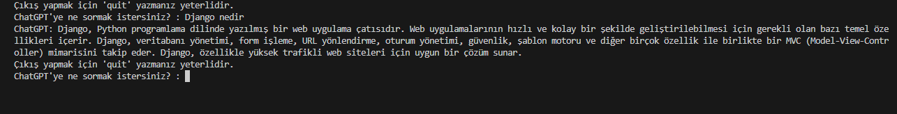

# Python ChatGPT API



## Installation
------------------------------------------
Öncelikle projeyi clonelayın.
```
git clone https://github.com/OnurHocaoglu/chatgpt_api.git
```
## Usage
----------------------------------------------------
Projeyi cloneladıktan sonra Visual Studio Code programında açınız.

Linux için:
```
cd chatgpt_api
code .
```
## Contributing
----------------------------------------------------
Pull requestler kabul edilir. Büyük değişiklikler için, lütfen önce neyi değiştirmek istediğinizi tartışmak için bir konu açınız.

## License
---------------------------------------------------------
[MIT](https://choosealicense.com/licenses/mit/)
-----------------------------------------------------
[Onurhocaoglu.com](http://www.onurhocaoglu.com)